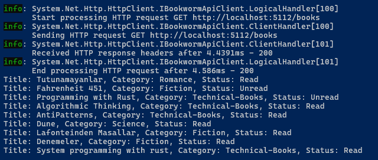
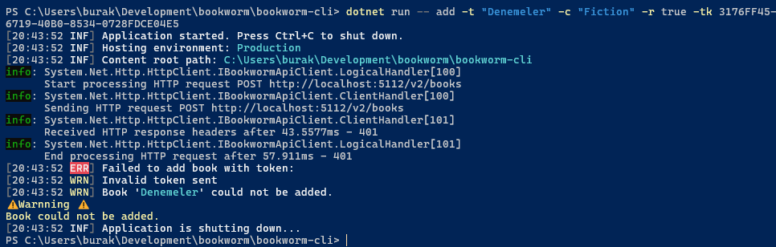

# Book Worm

Eğitimlerde kullanılmak üzere .Net platformunda yazılan bir CLI _(Command Line Interface)_ çalışması. Uygulama ile kategoriye göre kitapların bir listeye eklenmesi, listelenmesi, dosyaya çıkartılması veya dosyadan okunması gibi çeşitli fonksiyonellikler ele alınmaktadır. Kitap bilgilerini saklamak içinse Sqlite tabanlı oldukça basit bir API hizmet söz konusudur. Terminal uygulaması bu hizmeti kullanır.

```bash
# Belli bir kategoriye kitap eklemek

dotnet run -- add -t "Programming with Rust" -c "Technical-Books"

# Okunmuş olarak eklemek
dotnet run -- add -t "Tutunamayanlar" -c "Romance" -r true

# Kitapları listelemek
dotnet run -- list

# Listeden kitap çıkarmak
dotnet run -- remove -t "Tutunamayanlar"

# Dosyaya çıktı almak
dotnet run -- export -f "books.json"

# Dosyadan listeyi okumak
dotnet run -- import -f "books.json"

# Basit Access Token ile kitap eklemek
dotnet run -- add -t "Denemeler" -c "Fiction" -r true -tk 3176FF45-6719-40B0-8534-0728FDCE04E2

# Programı interaif modda çalıştırmak içinse
dotnet run -- interactive
```

Çalışma zamanından birkaç görüntü de ekleyelim.

API Tarafı,


Interaktif Moddan görüntüler







